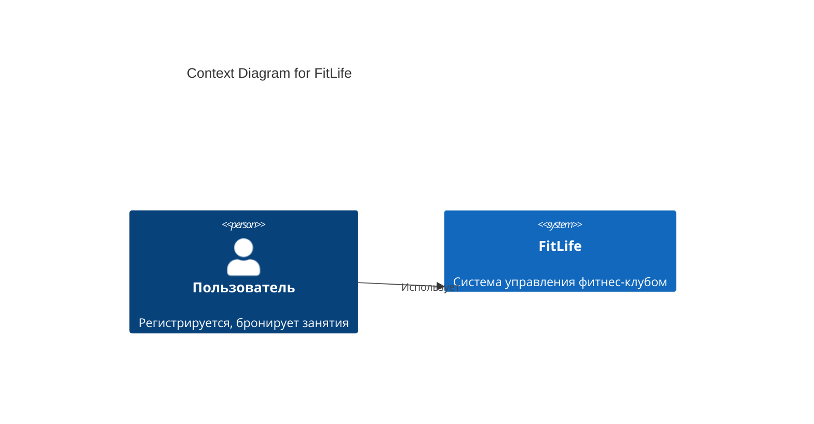
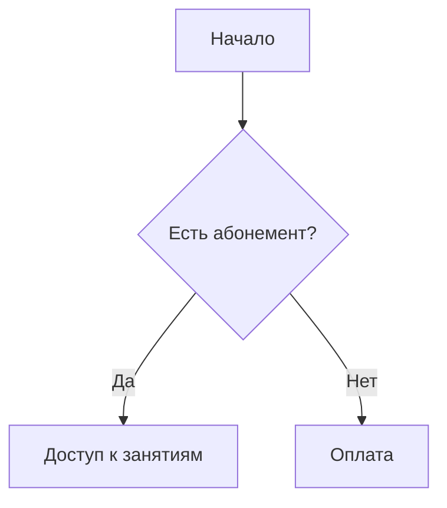
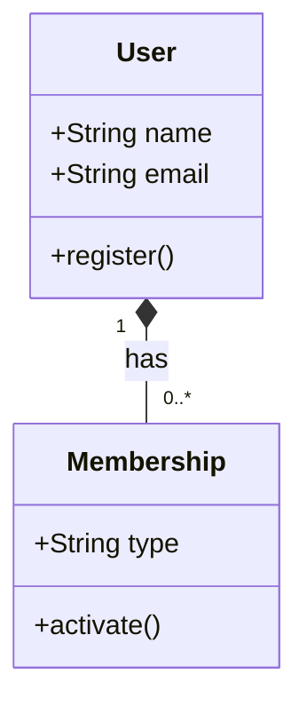
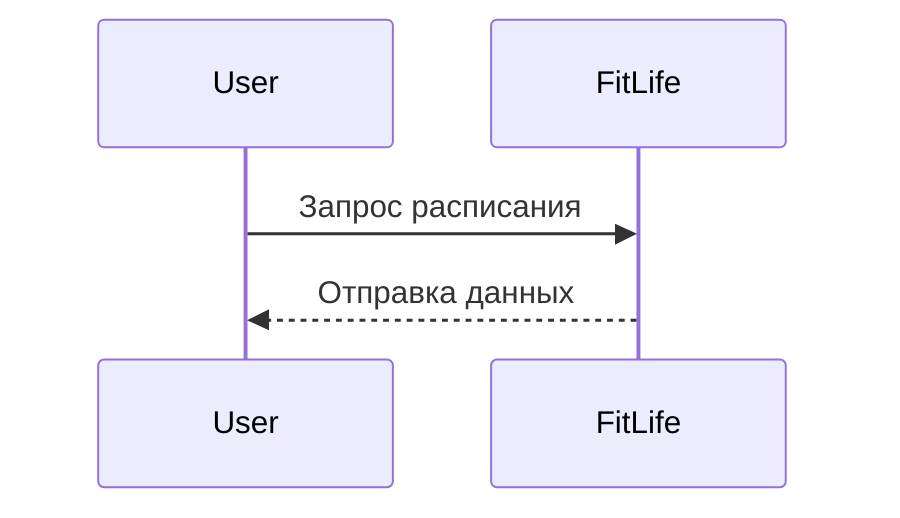
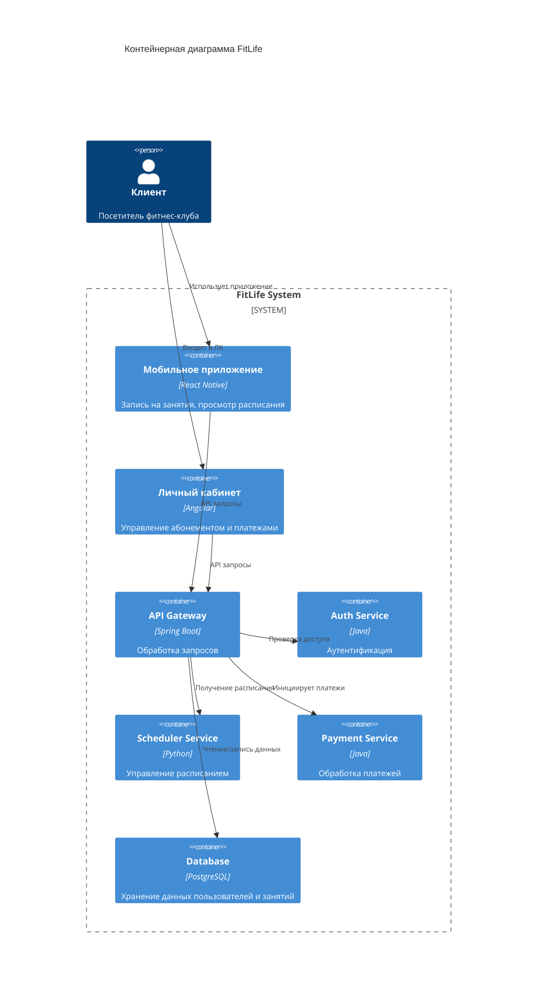

Простой пример

```mermaid
C4Context
  title Context Diagram for FitLife

  Person(user, "Пользователь", "Регистрируется, бронирует занятия")
  System(fitlife, "FitLife", "Система управления фитнес-клубом")

  Rel(user, fitlife, "Использует")
```

Блок-схема (Flowchart)

```mermaid
graph TD
  A[Начало] --> B{Есть абонемент?}
  B -->|Да| C[Доступ к занятиям]
  B -->|Нет| D[Оплата]
```

Диаграмма классов (FitLife)

```mermaid
classDiagram
  class User {
    +String name
    +String email
    +register()
  }

  class Membership {
    +String type
    +activate()
  }

  User "1" *-- "0..*" Membership : has
```

Диаграмма последовательностей

```mermaid
sequenceDiagram
  User->>FitLife: Запрос расписания
  FitLife-->>User: Отправка данных
```

Диаграмма контейнеров (C2 level) для FitLife

```mermaid

C4Container
    title Контейнерная диаграмма FitLife

    Person(member, "Клиент", "Посетитель фитнес-клуба")

    System_Boundary(fitlife_system, "FitLife System") {
        Container(mobile_app, "Мобильное приложение", "React Native", "Запись на занятия, просмотр расписания")
        Container(web_app, "Личный кабинет", "Angular", "Управление абонементом и платежами")
        Container(api, "API Gateway", "Spring Boot", "Обработка запросов")
        Container(auth, "Auth Service", "Java", "Аутентификация")
        Container(scheduler, "Scheduler Service", "Python", "Управление расписанием")
        Container(payment, "Payment Service", "Java", "Обработка платежей")
        Container(db, "Database", "PostgreSQL", "Хранение данных пользователей и занятий")
    }

    Rel(member, mobile_app, "Использует приложение")
    Rel(member, web_app, "Входит в ЛК")
    Rel(mobile_app, api, "API запросы")
    Rel(web_app, api, "API запросы")
    Rel(api, auth, "Проверка доступа")
    Rel(api, scheduler, "Получение расписания")
    Rel(api, payment, "Инициирует платежи")
    Rel(api, db, "Чтение/запись данных")
```